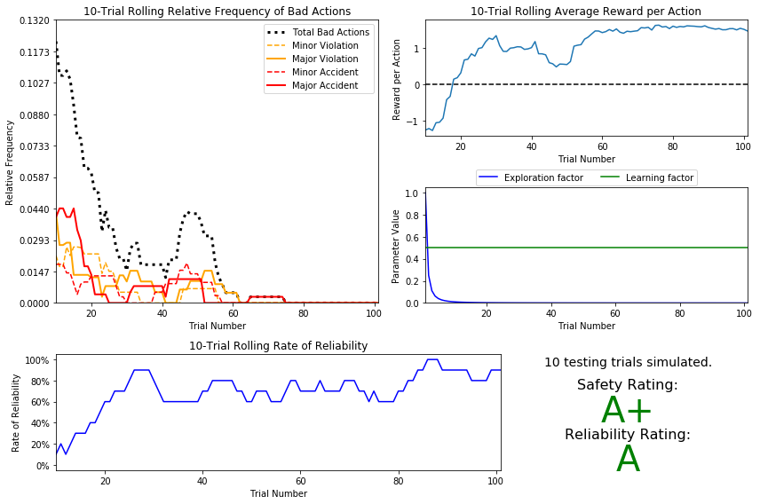

# SmartCab - Reinforcement Learning
This is my project for Machine Learning Engineering Nanodegree. 
The project is to train a SmartCab to travel round an environment following the US traffic laws.

## Final Results

## Updates
The code was initially made for Python 2. But minor adjustments in code allowed me to run it on Python 3. 
